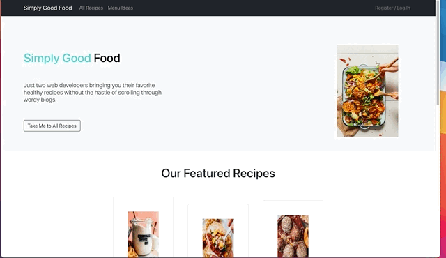

#  Project #3: Simply Good Food 

**Building upon Project 2, a React front-end app that consumed an API, we got to build the backend for this project.** 

**We built a full-stack application** by making our own backend and our own front-end.
Simply Good Food is a clone of the website Minimalist Baker (https://minimalistbaker.com/). 



## Goal 
A group project to design a MERN Stack application. 

**Timeframe**

Two weeks (30 course hours)

## Technologies

- JavaScript / Python (Selenium/BeautifulSoup)
- Express / Node.js
- MongoDB / mongoose
- Insomnia 
- React 
- React Router/Dom
- React-Bootstrap 
- VSCode
- Git/GitHub
- Slack 
- Excalidraw
- Trello 

## Project Brief 

What we did based on project specifications for our MVP:

- **Built a full-stack application** by making our own backend and our own front-end.
- **Used an Express API** to serve our data from MongoDB.  
- **Built a front-end that consumes our API** built with React and using the React-Bootstrap styling library.
- **Made a complete product** => Users have access to recipes and cookbook suggestions and can log in and leave a comment on recipes that they like. 
- **Implemented thoughtful user wireframes** => We spent a decent amount of time on our planning and had clear stretch goals indicated in the wireframes. Here is a link to our design: **[](https://excalidraw.com/#room=9c88b5ae7986d9bfcb56,LfIO3eDConef6D-iEdjaFw)**
- **Developed a visually impressive design** => We went for a fresh, minimalist approach, so not a lot of customizing with React-Bootstrap, but we looked at a few Squarespace designs and decided that there's nothing wrong going the "less is more" route. 
- **Deployed an API** => Here is a link to the api: **[](https://simply-good-food.herokuapp.com/)**
- **Deployed the app online** => Here is a link to our app: **[](https://willowy-biscotti-b0cdbb.netlify.app/)**
- **Extra's we add** - Emilie, my teammate is a data scientist and was able to use Selenium/BeautifulSoup to webscrape recipes from the Minimalist Baker website. This allowed us to import a lot of data in a short amount of time into our database.

## Simply Good Food 

**Our Focus:** Our group focused on simple stable code and tried to not wander too much into the weeds of super advanced functionality, as tempting as that may have been. Instead of reinventing the wheel, our group was interested in understanding how the wheel works. 

*Here's a sneak peak of our project:*


### Deployed version 

**[Simply Good Food](https://willowy-biscotti-b0cdbb.netlify.app/)**


## Planning 
To this end, we planned something manageable with a clear MVP and clear stretch goals.
We were asked to focus on quality, not quantity, so as a group of two people (with day jobs), this is what drove our decision making. We needed to be able to **accomplish something in the two weeks (30 class hrs)** we had. Also, compared to the other groups, we were a group of 2 and not a group of 3. 

We used Excalidraw for wireframing: 


We also set up a Trello Board that we'd use throughout our project:


## Development 

We spent the first week working on the backend and the second week on the front end. 

### Backend CRUD functionality 

After finishing our wireframe, we moved on to defining our schema and the different fields that were necessary 

```
const reviewSchema = new mongoose.Schema({
    // ? Inside here live our fields
    text: String,
    rating: Number,
    createdBy: { type: String, required: true },
    createAt: { type: Date, default: Date.now },
    user: { type: mongoose.Schema.ObjectId, ref: "User", required: true },
})

const recipeSchema = new mongoose.Schema({
    //These are the fields we found necessary after researching other recipe API suggestions 
    recipeName: { type: String, required: true, unique: true },
    author: String,
    type: { type: String, required: true, enum: ["Breakfast", "Lunch", "Dinner", "Snack", "Dessert", "Detox"] },
    prepTime: { type: String, required: true },
    cookTime: { type: String, required: false },
    nutrition: String,
    vegan: Boolean,
    vegeterian: Boolean,
    glutenFree: Boolean,
    featuredRecipe: Boolean,
    recipeIngredients: { type: Array, required: true },
    recipeInstructions: { type: Array, required: true },
    image: { type: String, required: false },
    description: { type: String, required: true },
    serve: { type: Number, required: true},
    review: [reviewSchema],
})
```
It was good that we spent so much time thinking about the data we'd need to pull through to the front end and the format that would make it move easily from our database to the front end. 

Since I had a little more time outside work than Emily, in the first week, I devoted time to setting up our API and connecting it to our MongoDB database. As we had learned the MVC pattern in class, it was great to implement on our own in this project.  

```

router.route("/recipes")
    .get(recipeController.index)
    .post(auth, recipeController.create)

router.route("/recipes/:id")
    .get(auth,recipeController.show)
    .delete(auth,recipeController.remove)
    .put(auth,recipeController.update)

router.route("/recipes/recipe-type/:recipeType")
     .get(auth,recipeController.showType)

router.route("/recipes/:id/review")
    .get(auth, reviewController.index)
    .post(auth, reviewController.create)

router.route("/recipes/:id/review/:reviewId")
    .put(auth, reviewController.update)
    .delete(auth, reviewController.remove)

router.route("/users")
    .get(auth, userController.index)

router.route("/register")
    .post(userController.register)
  
router.route("/login")
    .post(userController.login)

```

Working with the controllers, I explored some of the functions that mongoose offers out of the box. For example, in the case of updating a recipe, I used findOneAndUpdate(). 

```

async function update(req, res, next) {
    const id = req.params.id
    const recipeToUpdate = req.body
    if (!recipeToUpdate) return res.json({ message: "Recipe not found." })
    if (currentUser.role !== "admin") {
        return res.status(401).json({ message: "You must be an admin to update this recipe." })
    }
    try {
        const updatedRecipe = await Recipe.findOneAndUpdate({ _id: id }, recipeToUpdate, { new: true })
        updatedRecipe.set(recipeToUpdate)
        await updatedRecipe.save()
        res.status(201).json(updatedRecipe)
    } catch (err) {
        next(err)
    }

}

```
### Front end noteworthy features 

I worked a lot on the styling in the front end after I figured out how to use React-Bootstrap. I'm really pleased with the professional look of the layout. 


One of the components I worked on in the front end that proved a little tricky was figuring out how to get a random set of recipes to render on the Home Page. The way I did this was by fetching all the recipes and then writing a function that randomly selected 6 recipes. 

```
function HomeFeaturedRecipes() {
    const [featuredRecipes, setFeaturedRecipes] = useState(undefined)
    const [recipeData, setRecipeData] = useState(undefined)

    useEffect(() => {
        const getData = async () => {
            const res = await axios.get(`${DEV_API_URL}/recipes`)
            setRecipeData(res.data)
            const newArray = []
            for (var i = 0; i < 6; i++) {
                var idx = Math.floor(Math.random() * res.data.length);
                newArray.push(res.data[idx]);
            }
            console.log(newArray)
            console.log(recipeData)
            setFeaturedRecipes(newArray)
         
        }
        getData()
    }, [])
    
 
    if (!featuredRecipes) {
        return <p>Recipes Loading...</p>
    }

```
Our project has a page with All Recipes, around 100 of them: 


We have a page with links to recipes by menu like breakfast, lunch, dinner, and dessert. 


We have the page with the actual recipe and the possibility for a logged in user to leave a review. This function is not fully functional, but we got it working locally. 


And we have a carousel which I found easier to implement than I thought it would be. 


### Deployment 

It was really important to me that by the Tuesday before we presented that our backend was deployed on HerokuApp. As our instructor had said might be the case it took a little over 2 hours to  deploy to Heroku. 

Front-end deployment was on Netlify, and I spend 3 hours getting our project deployed the day before our project was to be presented. 

In both cases, running the deployment via the command line turned out to be the most effective approach as opposed to deploying through the Netlify website or the Heroku website. 

## Wins

- Efficient collaboration in the following areas: project & time management, code sharing & version control. Both of us were upfront about what hadn't worked for us in Project 2 and did a good job of communicating our communication and working styles. Work session stand-ups helped keep this communication going. Spending time setting up our individual GitHub branches with a "dev" branch we were regularly pushing to and pulling from worked really well. It wasn't until deployment that we pushed our dev branch code to the main branch. 
- Front and backends were fully deployed for the project presentation. 
- Implementing the image carousel was a lot of fun, and I was pleased to have figured out getting it to work. 
- Scoped a feasible project delivered within a fixed timeframe. 

---

## Challenges

- Determining & effectively utilising front end libraries like React-Bootstrap. Sense the styling library was new to both me and Emily, I started using Boostrap before I knew that React-Bootstrap existed. Regardless, we came up with a design that looks good. 
- Web-Scraping recipe data from the website we cloned took Emily a bit of time because the website we were using had a lot of pop-ups. I then had to edit the resulting JSON file before making a post request to our database. 

## Key learnings

- Spent time discovering the React-Bootstrap library
- Being more comfortable using Git and GitHub because my teammate was super supportive and answered a lot of questions
- How to deploy an API on heroku.com
- The work involved in planning and building an API


## If we had more time...

- Adding the sign out functionality & more pages, like a page of favorite cookbooks that Emily and I suggest. 
- I also wanted to create a page for people who wanted to do a detox. This would have required a Detox model in the backend, which we didn't create since we didn't know if we'd have time to implement it. 
- Polishing the design - our recipe cards on some of the pages just don't look centered or like they have the right shape. 
- Adding more front-end CRUD functionality, like user sign-out and maybe the possibility for users to post a recipe from the front end. Since Emily had taken on this responsibility on our Trello board, I left it to her to work on and probably could have jumped in a little sooner to ask if she needed help since she was working so much on the web scraping. 

Overall a super fun and successful project. 

